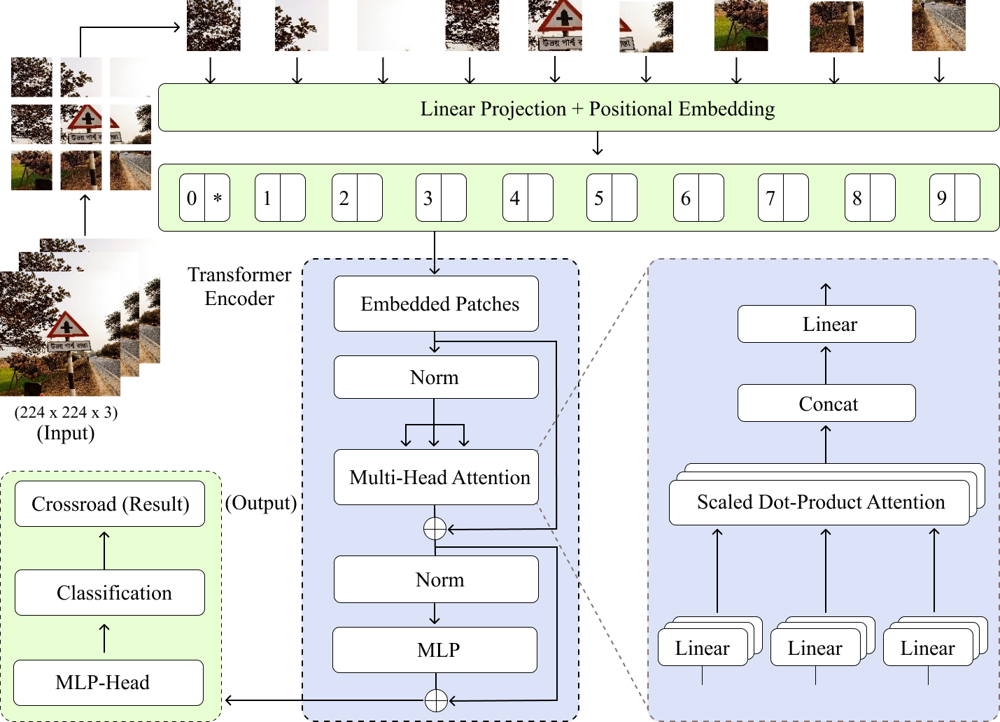
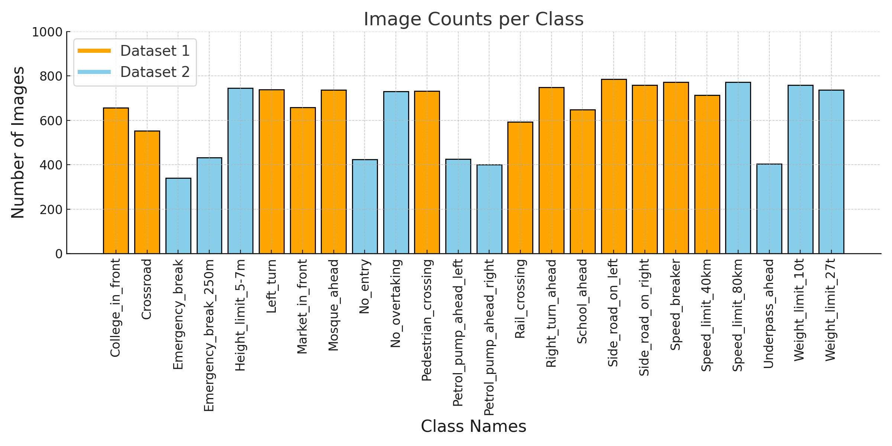
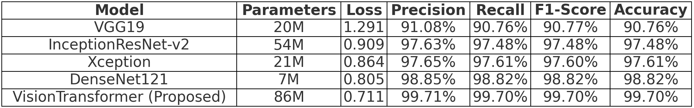
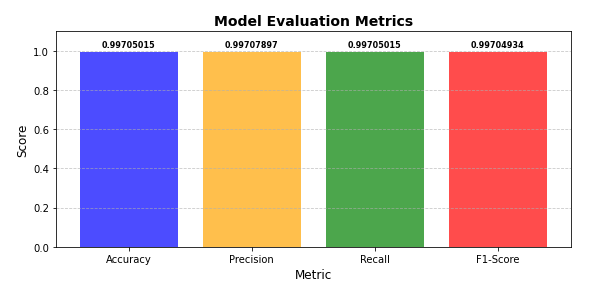

# A Vision Transformer-Based Approach to Traffic Sign Recognition on a Hybrid Bangladeshi Dataset 

## Overview
Traffic sign detection and classification play a crucial role in advancing Intelligent Transportation Systems (ITS) by ensuring road safety and supporting autonomous vehicle technologies. In this study, we present a novel approach to Bangladeshi traffic sign recognition by constructing a hybrid dataset that combines two distinct datasets. One dataset contains 13 predefined classes, while the other dataset contributes images that were selectively reorganized to form 11 additional traffic sign classes. The merged hybrid dataset integrates 24 diverse traffic sign classes, offering a comprehensive and unique benchmark for Bangladeshi traffic sign recognition. We propose a Vision Transformer (ViT)-based model, which is fine-tuned for optimal performance on the hybrid dataset. The proposed ViT model is evaluated against several state-of-the-art convolutional architectures, including VGG19, DenseNet121, Inception-ResNetV2 (IRv2), and Xception. Experimental results demonstrate that the ViT model achieves the highest validation accuracy of 99.7%, outperforming all baseline models. This study underscores the benefits of Vision Transformers for Bangladeshi traffic sign recognition, particularly in addressing the variability and complexity of the signs. It establishes a strong benchmark and provides insights into the application in real-world challenges.
 The model architecture is like this: 
#### ViT Architecture:
 
#### Merged Bangladeshi Dataset:

## Quickstart the project
1. Download the code in `ZIP` or open with `GitHub Desktop` or `https://github.com/dabbrata/Traffic-Sign-ViT-B.git`.
2. Then import `Traffic-sign-vit-with-tf.ipynb` file to your notebook.
3. Install required python dependencies into your python environment / virtual environment using `pip install -r Requirements.txt`.
4. Run all the cells of that imported (.ipynb) file.

## Dataset
The dataset used to recognize traffic sign: 
This dataset was constructed by merging two distinct datasets. The first [dataset](https://link.springer.com/chapter/10.1007/978-981-99-8937-9_37) contains 13 classes, all of which were included in our study. From the second [dataset](https://zenodo.org/records/11511846), we selected 11 classes. However, the classes in this dataset were unstructured, with images mixed and scattered among various categories. To be more specific, one of the datasets contains over 2,000 images representing thirteen different types of common traffic signs found in Bangladesh. After applying data augmentation techniques, the dataset was expanded to approximately 9,091 images. The second dataset consists of a total of 6,168 images, representing eleven distinct types of traffic signs commonly observed in Bangladesh.

## Workflow
The traffic sign recognition system using Vision Transformers (ViT) employed a hybrid dataset combining Bangladeshi traffic sign datasets, totaling 15,259 images. The images were resized to 224 × 224 pixels, with data augmentation for variability. ViT, with its multi-headed self-attention and classification head, was trained in TensorFlow on dual NVIDIA T4 GPUs. The optimizer used was SGD with momentum, and training lasted 25 epochs with early stopping. Performance metrics included accuracy (99.7%), precision, recall, F1-score, and cross-entropy loss (0.711). ViT outperformed CNN architectures like VGG19 and DenseNet121. Future work includes hybrid CNN-ViT models, datasets with adverse conditions, and lightweight model optimization for real-world deployment.

## Results
 
 

## Links and References
- Traffic Sign dataset1: https://link.springer.com/chapter/10.1007/978-981-99-8937-9_37
- Traffic Sign dataset2: https://zenodo.org/records/11511846
- Traffic Sign dataset(merged): https://www.kaggle.com/datasets/argh66/traffic-sign

## Contributors
1. [Argho Deb Das](https://github.com/MrArgho)

## Licensing
The code in this project is licensed under [MIT License](LICENSE).
